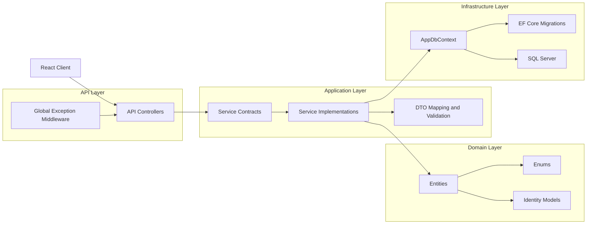
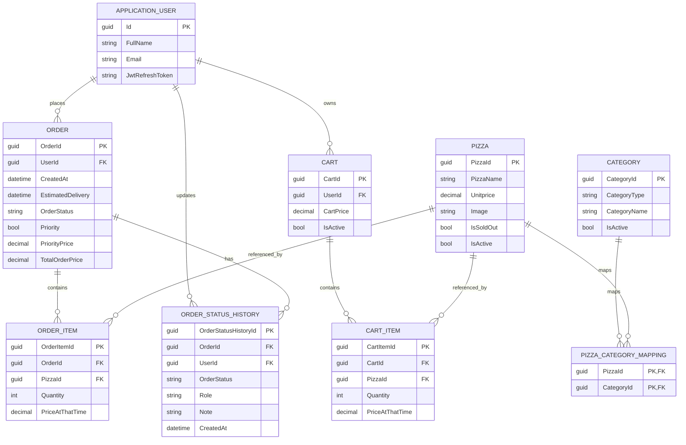

# SliceSync

SliceSync is a full-stack pizza ordering platform built with ASP.NET Core Web API and React.
It demonstrates production-oriented backend architecture, secure authentication, contract-driven API integration, and a polished frontend ordering experience.

This project is designed to be portfolio and resume ready: it shows full ownership of backend, frontend, database design, and integration decisions.

---

## Why This Project Is Hiring-Relevant

- Built and integrated a full-stack commerce workflow: authentication, menu browsing, cart operations, order placement, order tracking, and order history.
- Applied clean architecture layering in the backend to keep domain, service contracts, and infrastructure concerns separated.
- Solved real integration issues between frontend and backend contracts and standardized payloads for stable end-to-end behavior.
- Implemented JWT-based auth with role-aware APIs and protected order ownership flows.
- Designed a normalized relational model for products, carts, orders, and status history.
- Improved frontend UX with localized INR currency formatting, standardized image rendering, and navigation refinements.

---

## Product Features

### Customer-facing
- Register and login with JWT authentication.
- Browse a realistic pizza catalog with pricing and ingredients.
- Add, remove, and update quantities in cart.
- Place orders with address and optional priority delivery.
- Track order status and estimated delivery time.
- View personal order history.

### Admin and platform capabilities
- Category and pizza management APIs.
- Role-aware access (Admin, Customer, DeliveryGuy).
- Order status lifecycle support and status history persistence.
- Seeded realistic catalog data for demo and evaluation.

---

## Tech Stack

### Backend
- ASP.NET Core Web API (.NET 8)
- Entity Framework Core
- ASP.NET Core Identity
- JWT Bearer Authentication
- SQL Server LocalDB
- Swagger / OpenAPI

### Frontend
- React 18
- React Router
- Redux Toolkit
- Tailwind CSS
- Vite

### Database and schema
- SQL Server relational schema
- EF Core migrations
- SQL project for schema artifacts

---

## System Architecture (Clean Architecture Inspired)



### Layer mapping in this repository
- API layer: SliceSync.API/SliceSync.API
- Contracts and domain: SliceSync.API/SliceSync.Core
- Services: SliceSync.API/SliceSync.Service
- Data access and migrations: SliceSync.API/SliceSync.Infrastructure
- Frontend: SliceSync.Client

---

## ER Diagram



---

## Key Engineering Decisions

### 1) Contract-driven frontend/backend integration
- Introduced frontend-facing menu and order DTOs to avoid leaking internal entity shape.
- Standardized API JSON to camelCase for predictable React consumption.
- Added dedicated endpoints for menu, order details, and user-specific orders.

### 2) Authentication and ownership
- JWT with claims-based identity and role support.
- Auth-required order creation to prevent anonymous order loss.
- User-specific order history endpoint for secure access to personal data.

### 3) Cart strategy
- Client state kept in Redux for responsive UX.
- For authenticated users, cart operations also sync to server endpoints to persist state beyond browser memory.

### 4) Data model choices
- Many-to-many relationship between pizzas and categories through a mapping table.
- Separate Order and OrderStatusHistory entities for immutable order timeline tracking.
- Price snapshots captured on line items to preserve historical pricing integrity.

### 5) Error handling and reliability
- Global exception middleware centralizes API error responses.
- Input validation across DTOs and action handlers.
- Route-level guards and auth checks in both frontend and backend.

---

## API Surface (High-Level)

### Authentication
- POST /api/auth/register
- POST /api/auth/login
- POST /api/auth/logout
- POST /api/auth/generate-new-jwt-token

### Customer ordering
- GET /api/menu
- POST /api/orders
- GET /api/orders/{id}
- PATCH /api/orders/{id}
- GET /api/orders/mine
- POST /api/customer/addtocart
- POST /api/customer/removefromcart

### Admin management
- Category and pizza CRUD under admin controller routes.

Swagger is enabled in development for endpoint exploration.

---

## Frontend Architecture

- Routing with nested layouts and route loaders/actions.
- Redux slices for user and cart state.
- Service layer for API communication.
- Feature-first folder structure for maintainability.
- UI layer with reusable components and Tailwind utility styling.

---

## Project Structure

```
SliceSync.API/
	SliceSync.API/            # Web API host, controllers, middleware
	SliceSync.Core/           # Entities, DTOs, enums, service contracts
	SliceSync.Service/        # Business logic services
	SliceSync.Infrastructure/ # DbContext, migrations, data scripts
	SliceSync.Schemas.SQL/    # SQL schema project artifacts

SliceSync.Client/           # React application
```

---

## Local Setup

### Prerequisites
- .NET 8 SDK
- Node.js 18+
- SQL Server LocalDB (or SQL Server instance)

### Backend
1. Update connection string in SliceSync.API/SliceSync.API/appsettings.json if needed.
2. Apply migrations:
	 - dotnet ef database update --project SliceSync.Infrastructure --startup-project SliceSync.API
3. Run API:
	 - dotnet run --project SliceSync.API

### Frontend
1. Open SliceSync.Client
2. Install dependencies:
	 - npm install
3. Run app:
	 - npm run dev

Frontend default URL: http://localhost:5173
Backend default URL: https://localhost:7094

---

## Security Notes

- JWT issuer/audience validation is enabled.
- Access denied and unauthorized responses return proper HTTP codes.
- Role claims are embedded and used for authorization.
- Refresh token support is included in auth flow.

For production, move secrets from appsettings.json into secure secret management.

---

## What I Would Improve Next

- Add automated tests (unit, integration, and contract tests).
- Add CI pipeline with build, lint, and test gates.
- Add observability (structured logs, traces, dashboards).
- Add background job for order notifications.
- Implement payment gateway integration.
- Add caching layer for menu reads.

---

## Resume-Ready Summary

SliceSync demonstrates end-to-end full-stack engineering with clean backend layering, secure auth, relational data modeling, and practical frontend integration. It showcases the ability to design and ship a real-world transactional system rather than only a UI prototype.

---

## Copy-Ready Resume Bullets

- Engineered a full-stack pizza ordering platform using ASP.NET Core Web API, React, Redux Toolkit, and SQL Server, implementing complete user journeys from authentication to order tracking.
- Applied clean architecture principles by separating API, domain contracts, business services, and infrastructure, improving maintainability and enabling faster feature iteration.
- Designed and integrated secure JWT authentication with role-based access control and user-owned order flows, preventing unauthorized access and data leakage.
- Built contract-driven frontend/backend integration using dedicated DTOs and camelCase API responses, eliminating payload mismatches and stabilizing end-to-end behavior.
- Modeled and implemented relational data structures for pizzas, carts, orders, and status history with EF Core migrations and SQL schema artifacts.

## Interview Talking Points

- Why clean architecture was selected and how dependency direction was kept from API to contracts/services to infrastructure.
- How contract mismatches were identified and fixed between React and .NET APIs.
- Tradeoffs in cart persistence strategy: responsive local state plus server sync for authenticated users.
- How JWT claim design enabled secure user-specific order ownership and history retrieval.
- How the schema supports extensibility for payments, notifications, and operational analytics.


